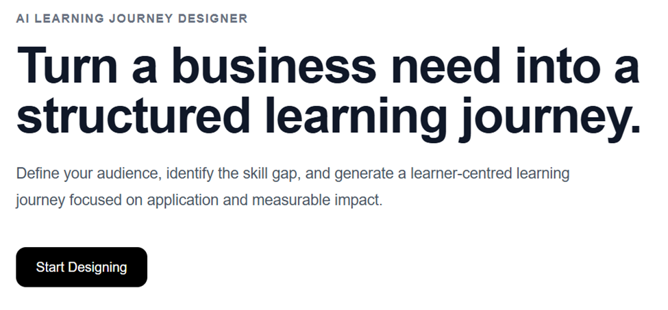
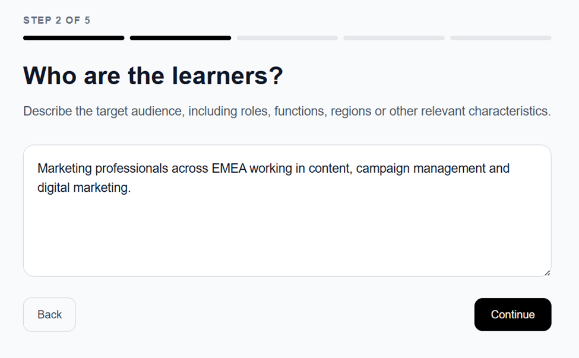
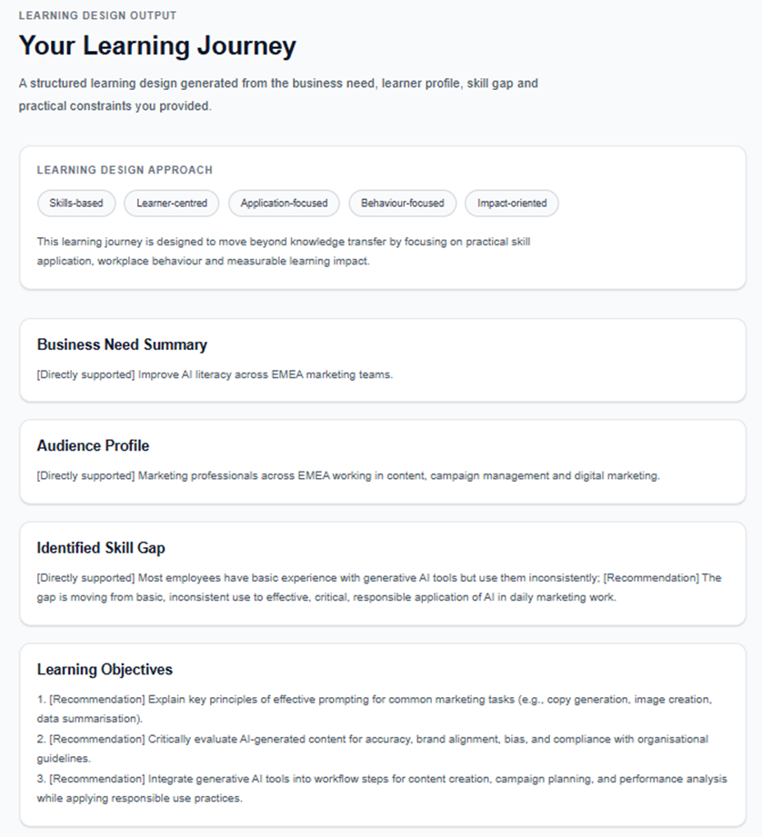

 # AI Learning Journey Designer

An AI-powered learning design assistant that turns a business need into a structured, learner-centred and skills-based learning journey.

The tool is designed for corporate Learning & Development contexts and focuses on practical skill application, behaviour change and measurable learning impact rather than knowledge transfer alone.

## Why I Built This

Many learning initiatives start too quickly with course creation.

This project starts one step earlier by asking:

- What business need are we trying to address?
- Who are the learners?
- What can they currently do?
- What skill or behaviour needs to improve?
- What practical constraints should the learning design consider?

The system then uses these inputs to generate a structured learning journey.

## Live Demo

Explore the working MVP:

[Open the Live Demo](https://ai-learning-journey-designer.vercel.app)

The demo takes a business need, learner profile, skill gap and practical constraints, then generates a structured learning journey with objectives, assessment, behaviour-change goals and impact metrics.

## Screenshots

### Landing Page

### Learning Design Wizard

### Generated Learning Journey

## Core Workflow

Business Need  
→ Target Audience  
→ Current Skill Level  
→ Desired Skill or Behaviour  
→ Constraints  
→ AI-Generated Learning Design

## Generated Output

The system produces:

- Business Need Summary
- Audience Profile
- Identified Skill Gap
- Learning Objectives
- Learning Journey
- Assessment Approach
- Behaviour Change Goal
- Impact Metrics

## Learning Design Principles

The solution is designed around five principles:

- Skills-based
- Learner-centred
- Application-focused
- Behaviour-focused
- Impact-oriented

The aim is to support learning experiences that help people apply skills in real work, not simply complete content.

## Quality Guardrails

The AI is instructed not to invent organisational context or learner characteristics that were not provided.

If user input is:

- too vague
- numeric-only
- ambiguous
- meaningless
- insufficient

the system explicitly requests clarification instead of fabricating a learning design.

This helps reduce unsupported assumptions and improves the reliability of generated outputs.

## Example Use Case

### Business Need

Improve AI literacy across EMEA marketing teams.

### Target Audience

Marketing professionals across EMEA working in content, campaign management and digital marketing.

### Current Level

Most employees have basic experience with generative AI tools but use them inconsistently.

### Desired Skill

Use generative AI effectively, critically and responsibly in daily marketing work.

### Constraints

Maximum 3 hours total learning time, blended learning, suitable for multiple EMEA markets.

The AI then generates a structured learning journey with learning objectives, workplace activities, assessment and impact metrics.

## Technology

- Next.js
- TypeScript
- Tailwind CSS
- OpenRouter API
- Large Language Models

## Architecture

User Input  
→ Next.js Interface  
→ Server-side API Route  
→ OpenRouter  
→ Structured JSON Response  
→ Learning Journey Interface

The API key is stored server-side using environment variables and is never exposed in the client interface.

## Current MVP Capabilities

- Five-step learning needs workflow
- Structured AI-generated learning journeys
- Skills gap identification
- Learning objectives generation
- Workplace application activities
- Assessment design
- Behaviour change goals
- Impact metrics
- Input quality guardrails
- Responsive web interface

## Future Development

Potential future improvements include:

- SME review workflow
- EMEA localisation support
- Learning pathway templates
- Export to PDF or Word
- Learning platform integration
- Feedback analysis
- Learning impact dashboards
- Skills framework integration

## Project Goal

This project explores how AI can support Learning & Development professionals in moving from business needs to structured learning experiences while keeping the human learning designer responsible for judgement, validation and final decisions.

AI supports the design process. It does not replace the Learning & Development professional.